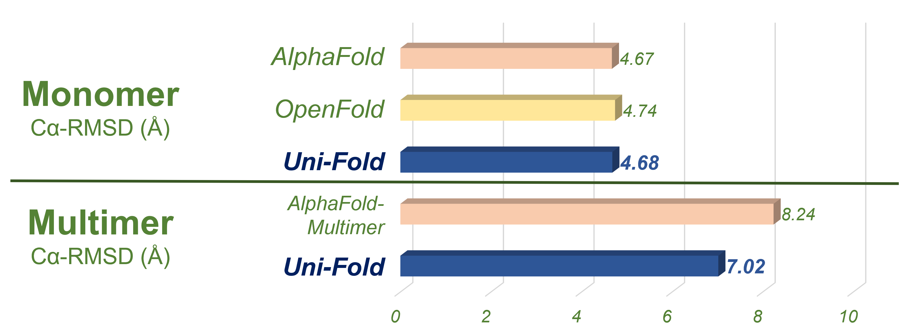
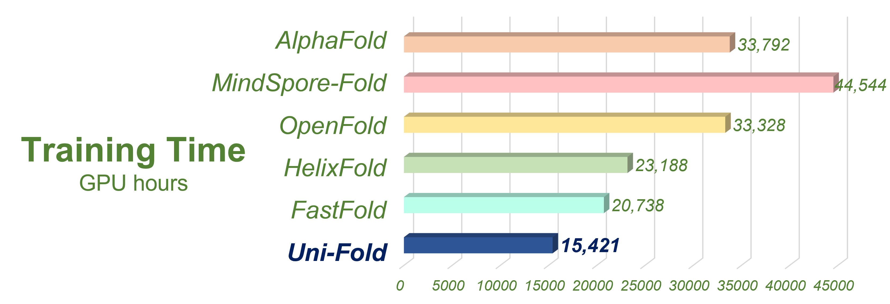

# Uni-Fold: an open-source platform for developing protein models beyond AlphaFold.

We proudly present Uni-Fold as a thoroughly open-source platform for developing protein models beyond [AlphaFold](https://github.com/deepmind/alphafold/). Uni-Fold introduces the following features:

- Reimplemented AlphaFold and AlphaFold-Multimer models in PyTorch framework. **This is currently the first (if any else) open-source repository that supports training AlphaFold-Multimer.**

- Model correctness proved by successful from-scratch training with equivalent accuracy, both monomer and multimer included.

- Highest efficiency among existing AlphaFold implementations (to our knowledge).

- Easy distributed training based on [Uni-Core](https://github.com/dptech-corp/Uni-Core/), as well as other conveniences including half-precision training (`float16/bfloat16`), per-sample gradient clipping, and fused CUDA kernels.

- Convenient web server at [Hermite™](https://hermite.dp.tech/). [More Information](#inference-on-hermite)


<center>
<small>
Figure 1. Uni-Fold successfully predicted the interaction between the nanobody and the GPCR-G protein complex, while AlphaFold-Multimer failed.
</small>
</center>

&nbsp;

We evaluated Uni-Fold on PDB structures release after our training set with less than 40% template identity. The structures for evaluations are included in [`evaluation`](./evaluation). Uni-Fold enjoys similar monomer prediction accuracy and better multimer prediction accuracy compared with AlphaFold(-Multimer). We also benchmarked the efficiency of Uni-Fold. The end-to-end training speed of Uni-Fold is about 2.2 times of the official AlphaFold. More evaluation results and details are included in our [bioRxiv preprint](https://www.biorxiv.org/content/10.1101/2022.08.04.502811).


<center>
<small>
Figure 2. Uni-Fold has similar performance on monomers and better performance on multimers compared with AlphaFold(-Multimer).
</small>
</center>

&nbsp;


<center>
<small>
Figure 3. Uni-Fold is to our knowledge the fastest implemetation of AlphaFold.
</small>
</center>

&nbsp;

The name Uni-Fold is inherited from our previous repository, [Uni-Fold-JAX](https://github.com/dptech-corp/Uni-Fold-jax). First released on Dec 8 2021, Uni-Fold-JAX was the first open-source project (with training scripts) that successfully reproduced the from-scratch training of AlphaFold. Until recently, Uni-Fold-JAX is still the only project that supports training of the original AlphaFold implementation in JAX framework. Due to efficiency and collaboration considerations, we moved from JAX to PyTorch on Jan 2022, based on which we further developed the multimer models.

---

## Installation and Preparations

### Installing Uni-Fold

Uni-Fold is implemented on a distributed PyTorch framework, [Uni-Core](https://github.com/dptech-corp/Uni-Core). As Uni-Core needs to compile CUDA kernels in installation which requires specific CUDA and PyTorch versions, we provide a Docker image to save potential trouble. 

To use GPUs within docker you need to [install nvidia-docker-2](https://docs.nvidia.com/datacenter/cloud-native/container-toolkit/install-guide.html#docker) first. Use the following command to pull the docker image:

```bash
docker pull dptechnology/unifold:pytorch1.11.0-cuda11.3-latest
```

Then, you can create and attach into the docker container, and clone & install unifold.

```bash
git clone https://github.com/dptech-corp/Uni-Fold
cd Uni-Fold
pip install -e .
```

### Preparing the datasets

Training and inference with Uni-Fold require homology searches on sequence and structure databases. Use the following command to download these databases:

```bash
  bash scripts/download_all_data.sh /path/to/database/directory
```

Make sure there is at least 3TB storage space for downloading (~500GB) and uncompressing the databases.


### Downloading the pre-trained model parameters

Inferenece and finetuning with Uni-Fold requires pretrained model parameters. Use the following command to download the parameters:
```bash
wget https://uni-fold.dp.tech/unifold_params_2022-08-01.tar.gz
tar -zxf unifold_params_2022-08-01.tar.gz
```
It contains 1 **monomer** and 1 **multimer** pretrained model parameters, whose model name are `model_2_ft` and `multimer_ft` respectively.

## Converting the AlphaFold and OpenFold parameters to Uni-Fold
One can convert the pretrained AlphaFold and OpenFold parameters to Uni-Fold format via the following commands.
```bash
python scripts/convert_alphafold_to_unifold.py \
    /path/to/alphafold_params.npz \   # AlphaFold params *.npz file
    /path/to/unifold_format.pt \      # save checkpoint in Uni-Fold format
    alphafold_model_name \            # specify model name, e.g. model_2_af2, multimer_af2
```

```bash
python scripts/convert_openfold_to_unifold.py \
    /path/to/openfold_params.pt \     # OpenFold params *.pt file
    /path/to/unifold_format.pt \      # save checkpoint in Uni-Fold format
```
## Running Uni-Fold

After properly configurating the environment and databases, run the following command to predict the structure of the target fasta:

```bash
bash run_unifold.sh \
    /path/to/the/input.fasta \        # target fasta file
    /path/to/the/output/directory/ \  # output directory
    /path/to/database/directory/ \    # directory of databases
    2020-05-01 \                      # use templates before this date
    model_name \                      # specify model name, must be consistent with model parameters
    /path/to/model_parameters.pt      # model parameters
```

For monomer prediction, each fasta file shall contain only one sequence; for multimer prediction, the input fasta file shall contain all sequences of the target complex including duplicated homologous sequences. That is, **chains with identical sequences shall be duplicated to their number in the complex**.

### Prediction results

The output directory of running Uni-Fold contain the predicted structures in `*.pdb` files, where `best.pdb` contains prediction with the highest confidence. Besides, other outputs are dumped in `*.pkl.gz` files. We summarize the confidence metrics, namely `plddt` and `iptm+ptm` in `*.json` files.

## Training Uni-Fold

Training Uni-Fold relies on pre-calculated features of proteins. We provide a demo dataset in the [example data](example_data) folder. A larger dataset will be released soon.

### Demo case

To start with, we provide a demo script to train the monomer/multimer system of Uni-Fold:

```bash
bash train_monomer_demo.sh .
```

and

```bash
bash train_multimer_demo.sh .
```

This command starts a training process on the [demo data](example_data) included in this repository. Note that this demo script only tests the correctness of package installation and does not reflect any true performances.


### From-scratch Training

Run the following command to train Uni-Fold Monomer/Multimer from-scratch:

```bash
bash train_monomer.sh \                 # train_multimer.sh for multimer
    /path/to/training/data/directory/ \ # dataset directory
    /path/to/output/directory/ \        # output directory where parameters are stored
    model_2_af2                         # model name
```

Note that:

1. The dataset directory should be configurated in a similar way as the [example data](example_data).
2. The output directory should have enough space to store model parameters (~1.5GB per checkpoint, so empirically 60GB satisfies the default configuration in the shell script).
3. We provide several default model names in [config.py](unifold/config.py), namely `model_1`, `model_2`, `model_2_af2` etc. for monomer models and `multimer`, `multimer_af2` etc. for multimer models. Check `model_config()` function for the differences between model names. You may also personalize your own model by modifying the function (i.e. forking the if-elses).


### Finetuning

Run the following command to finetune the given Uni-Fold Monomer/Multimer parameters:

```bash
bash finetune_monomer.sh \              # finetune_multimer.sh for multimer
    /path/to/training/data/directory/ \ # dataset directory
    /path/to/output/directory/ \        # output directory where parameters are stored
    /path/to/pretrained/parameters.pt \ # pretrained parameters
    model_2_af2                         # model name
```

Besides the notices in the previous section, additionaly note that:

1. The model architecture should be correctly specified by the model name.
2. Checkpoints must be in Uni-Fold format (`*.pt`).

## Inference on Hermite

We provide covenient structure prediction service on [Hermite™](https://hermite.dp.tech/), a new-generation drug design platform powered by AI, physics, and computing. Users only need to upload sequences of protein monomers and multimers to obtain the predicted structures from Uni-Fold, acompanied by various analyzing tools. [Click here](https://docs.google.com/document/d/1iFdezkKJVuhyqN3WvzsC7-422T-zf18IhP7M9CBj5gs) for more information of how to use Hermite™.

## Citing this work

If you use the code, the model parameters, the web server at [Hermite™](https://hermite.dp.tech/), or the released data of Uni-Fold as well as [Uni-Fold-JAX](https://github.com/dptech-corp/Uni-Fold-jax), please cite

```bibtex
@article {uni-fold,
	author = {Li, Ziyao and Liu, Xuyang and Chen, Weijie and Shen, Fan and Bi, Hangrui and Ke, Guolin and Zhang, Linfeng},
	title = {Uni-Fold: An Open-Source Platform for Developing Protein Folding Models beyond AlphaFold},
	year = {2022},
	doi = {10.1101/2022.08.04.502811},
	URL = {https://www.biorxiv.org/content/early/2022/08/06/2022.08.04.502811},
	eprint = {https://www.biorxiv.org/content/early/2022/08/06/2022.08.04.502811.full.pdf},
	journal = {bioRxiv}
}
```

## Acknowledgements

Our training framework is based on [Uni-Core](https://github.com/dptech-corp/Uni-Core/). Implementation of fused operators referred to  [fused_ops](https://github.com/guolinke/fused_ops/) and [OneFlow](https://github.com/Oneflow-Inc/oneflow). We partly referred to an early version of [OpenFold](https://github.com/aqlaboratory/openfold) for some of the PyTorch implementations, while mostly followed the original code of [AlphaFold](https://github.com/deepmind/alphafold/). For the data processing part, we followed [AlphaFold](https://github.com/deepmind/alphafold/), and referred to utilities in [Biopython](https://biopython.org/), [HH-suite3](https://github.com/soedinglab/hh-suite/), [HMMER](http://eddylab.org/software/hmmer/), [Kalign](https://msa.sbc.su.se/cgi-bin/msa.cgi), [pandas](https://pandas.pydata.org/), [NumPy](https://numpy.org/), and [SciPy](https://scipy.org/).

## License and Disclaimer

Copyright 2022 DP Technology.

### Code License

Uni-Fold is licensed under permissive Apache Licence, Version 2.0. You may obtain a copy of the License at https://www.apache.org/licenses/LICENSE-2.0.

### Model Parameters License

The Uni-Fold parameters are made available under the terms of the Creative Commons Attribution 4.0 International (CC BY 4.0) license. You can find details at: https://creativecommons.org/licenses/by/4.0/legalcode

### Contributing to Uni-Fold

Uni-Fold is an ongoing project. Our target is to develop better protein folding models and to apply them in real scenarios together with the entire community. We welcome all contributions to this repository, including but not limited to 1) reports and fixes of bugs, 2) new features and 3) accuracy and efficiency improvements. Please refer to [CONTRIBUTING.md](CONTRIBUTING.md) for more information.

### Third-party software

Use of the third-party software, libraries or code referred to in the [Acknowledgements](README.md/#acknowledgements) section above may be governed by separate terms and conditions or license provisions. Your use of the third-party software, libraries or code is subject to any such terms and you should check that you can comply with any applicable restrictions or terms and conditions before use.
